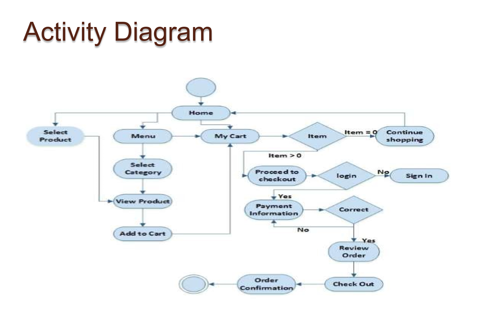
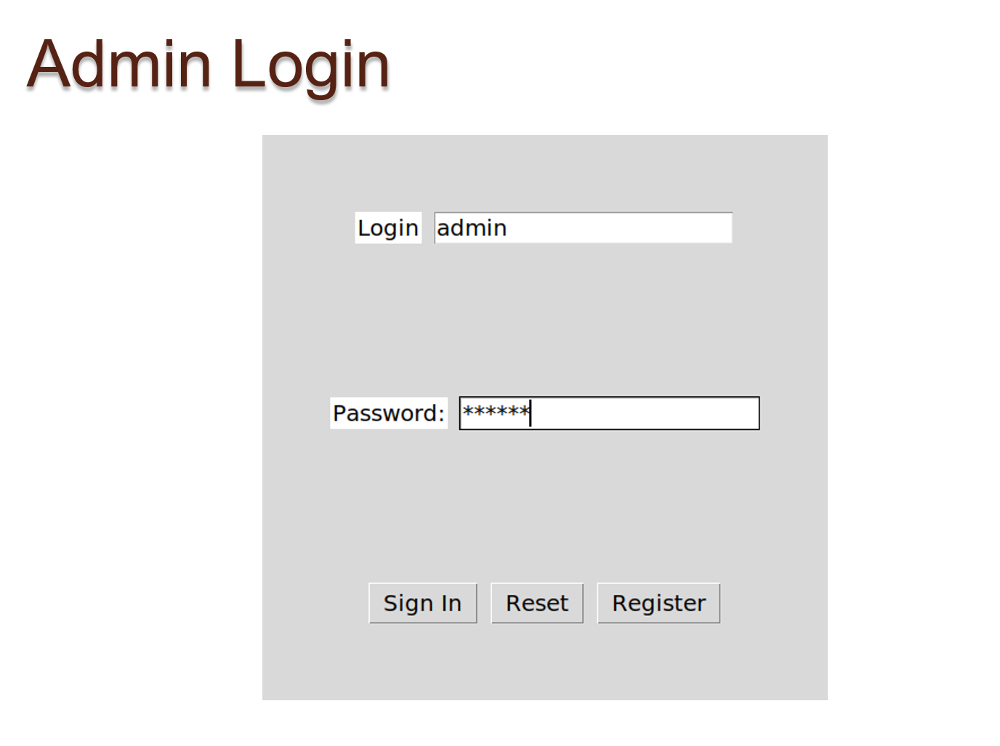
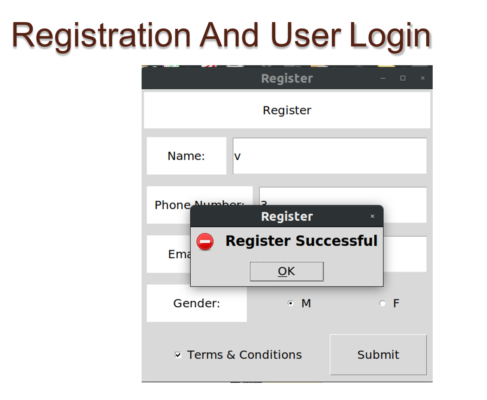
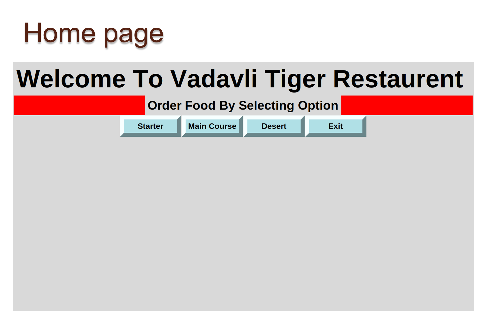
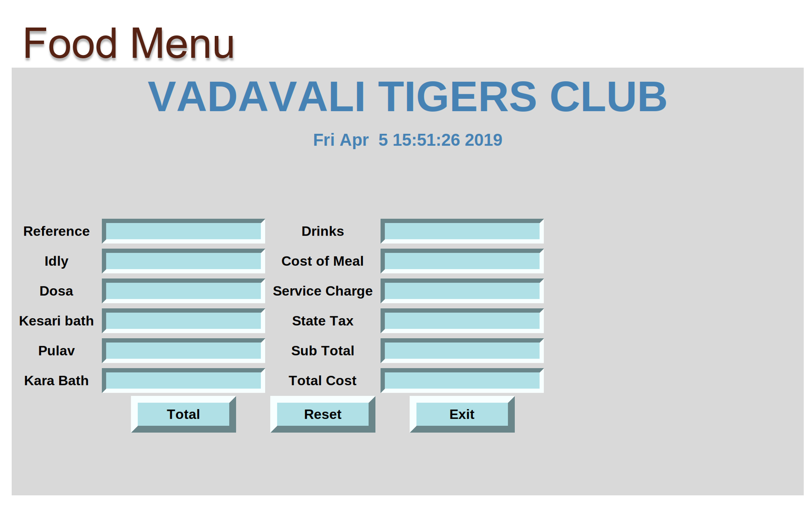

# Restaurant Management System

This is a simple Restaurant Management System GUI application built using Python's Tkinter library. It allows users to place orders for various food items and drinks, calculates the total cost, and provides options to reset the order or exit the application.

## Features

- **Order Placement**: Users can enter the quantity of each food item and drink they wish to order.
- **Total Calculation**: The system calculates the total cost of the order, including taxes and service charges.
- **Reset Functionality**: Users can reset the order form to start over.
- **Exit Option**: Allows users to exit the application.



## Prerequisites

- Python 3.x
- Tkinter (usually comes pre-installed with Python)

## Usage

1. Clone the repository to your local machine:

    ```bash
    git clone <repository-url>
    ```

2. Navigate to the project directory:

    ```bash
    cd restaurant-management-system
    ```

3. Run the Python script:

    ```bash
    python main.py
    ```

4. The application window will open, allowing you to place orders.

## Screenshots









## Contributing

Contributions are welcome! For major changes, please open an issue first to discuss what you would like to change.

## License

GNU GPL v3.0 License.

## Contact Information

For any inquiries or issues, please contact:
- **Pritesh Gandhi**
- **Email**: pgandhi1412@gmail.com
- **GitHub**: [YourGitHubProfile](https://github.com/Devil-Code)

---

Feel free to customize this template to better fit your project. Let me know if you need further assistance!
